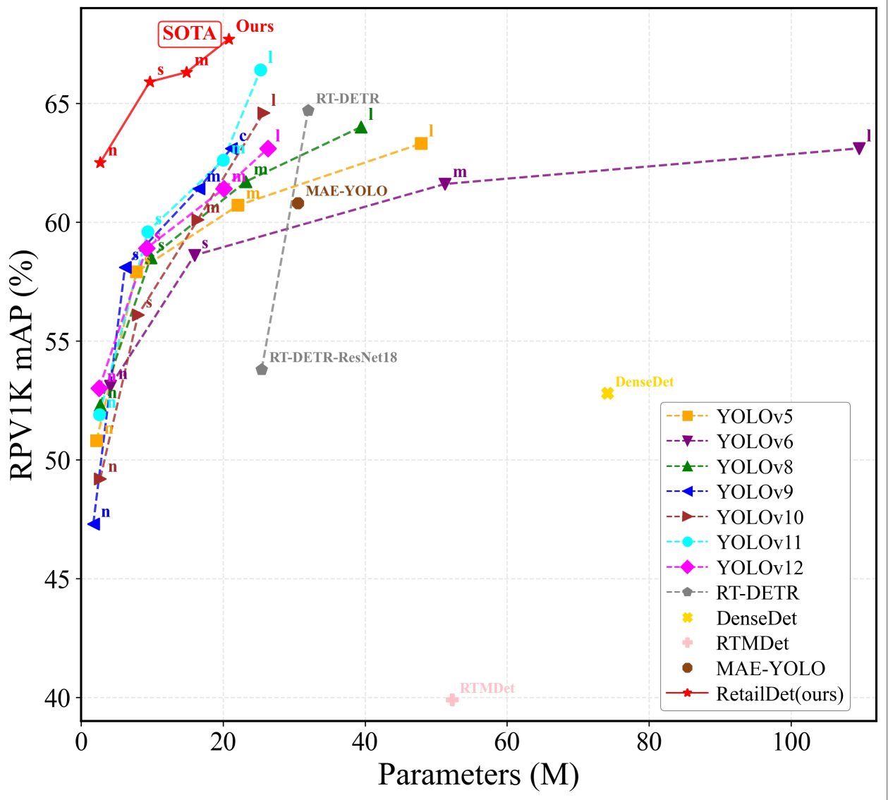

# RetailDet
Coming soon...
# Purpose
Our team's research direction: We aim to design a neural network model to construct a high-performance object detector, which is tailored for retail scenarios characterized by high-density distribution and diverse scales. This detector features low-latency inference and can be deployed on edge computing devices. Addressing the bottlenecks in existing YOLO-series models, such as insufficient capability to handle scenarios with high-density distribution and diverse scales, as well as suboptimal inference efficiency at the edge, we focus on researching lightweight architecture design and efficient feature extraction techniques. Our goal is to achieve collaborative optimization of detection accuracy and inference speed, creating a new-generation object detection solution that balances high precision and real-time performance. We welcome all interested researchers to get in touch with us, and let us work together to research intelligent new retail.

## 📖 Overview
This repository contains our research implementation for “RetailDet”. 
The code and pretrained weights will be made available upon paper acceptance.

## 🔄 Status
⏳ Paper is currently under review. The code and pretrained weights will be released upon acceptance.

## 📋 Coming Soon
- [ ] 💾 Project resources download link
- [ ] 📝 paper documentation
- [ ] 📊 Statistics
- [ ] 📌 Benchmark results

## 🔍 Visual Examples of Detection Results
<div style="display: flex; justify-content: center; gap: 20px; margin: 20px 0;">
  
  
  
</div>

## 🎯 Benchmark Results
<div style="display: flex; justify-content: center; gap: 20px; margin: 20px 0;">
  
</div>
<div style="display: flex; justify-content: center; gap: 20px; margin: 20px 0;">
  
</div>

## 📬 Contact
For questions and collaboration:
- 📮 Email: bidong.chen@mpu.edu.mo
- 📮 Email: mddll8945@gmail.com
- 🔧 Open an [issue](../../issues/new)
---
💡 **Tip:** Before creating a new issue, please check if a similar issue already exists in our [issue tracker](../../issues).

## 📝 Citation
If you use this dataset in your research, please cite our paper:
```bibtex

